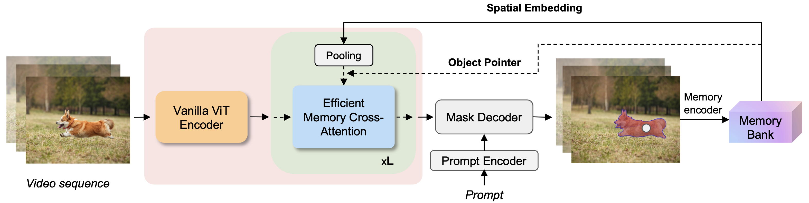
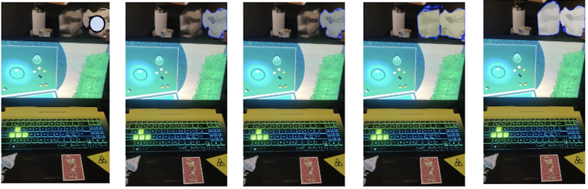
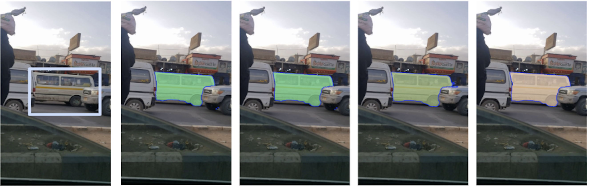

# Efficient Track Anything
[[`📕Project`](https://yformer.github.io/efficient-track-anything/)][[`🤗Gradio Demo`](https://10f00f01361a8328a4.gradio.live)][[`📕Paper`](https://arxiv.org/pdf/2411.18933)][[`🤗Checkpoints`]](https://huggingface.co/yunyangx/efficient-track-anything/tree/main)

The **Efficient Track Anything Model(EfficientTAM)** takes a vanilla lightweight ViT image encoder. An efficient memory cross-attention is proposed to further improve the efficiency. Our EfficientTAMs are trained on SA-1B (image) and SA-V (video) datasets. EfficientTAM achieves comparable performance with SAM 2 with improved efficiency. Our EfficientTAM can run **>10 frames per second** with reasonable video segmentation performance on **iPhone 15**. Try our demo with a family of EfficientTAMs at [[`🤗Gradio Demo`](https://10f00f01361a8328a4.gradio.live)].



## News
[Jan.5 2025] We add the support for running Efficient Track Anything on Macs with MPS backend. Check the example [app.py](https://github.com/yformer/EfficientTAM/blob/main/app.py).

[Jan.3 2025] We update the codebase of Efficient Track Anything, adpated from the latest [SAM2](https://github.com/facebookresearch/sam2) codebase with improved inference efficiency. Check the latest [SAM2](https://github.com/facebookresearch/sam2) update on Dec. 11 2024 for details. Thanks to SAM 2 team!


[Dec.22 2024] We release [`🤗Efficient Track Anything Checkpoints`](https://huggingface.co/yunyangx/efficient-track-anything/tree/main).

[Dec.4 2024] [`🤗Efficient Track Anything for segment everything`](https://5239f8e221db7ee8a0.gradio.live/). Thanks to @SkalskiP!

[Dec.2 2024] We provide the preliminary version of Efficient Track Anything for demonstration.

## Online Demo & Examples
Online demo and examples can be found in the [project page](https://yformer.github.io/efficient-track-anything/).

## EfficientTAM Video Segmentation Examples
  |   |   |
:-------------------------:|:-------------------------:
SAM 2 | 
EfficientTAM |  

## EfficientTAM Image Segmentation Examples
Input Image, SAM, EficientSAM, SAM 2, EfficientTAM
  |   |   |
:-------------------------:|:-------------------------:
Point-prompt | 
Box-prompt |  
Segment everything |

## Model
EfficientTAM checkpoints are available at the [Hugging Face Space](https://huggingface.co/yunyangx/efficient-track-anything/tree/main).

## Getting Started

### Installation

```bash
git clone https://github.com/yformer/EfficientTAM.git
cd EfficientTAM
conda create -n efficient_track_anything python=3.12
conda activate efficient_track_anything
pip install -e .
```
### Download Checkpoints

```bash
cd checkpoints
./download_checkpoints.sh
```

We can benchmark FPS of efficient track anything models on GPUs and model size.

### FPS Benchmarking and Model Size

```bash
cd ..
python efficient_track_anything/benchmark.py
```

### Launching Gradio Demo Locally
For efficient track anything video, run
```
python app.py
```
For efficient track anything image, run
```
python app_image.py
```


### Building Efficient Track Anything
You can build efficient track anything model with a config and initial the model with a checkpoint,
```python
import torch

from efficient_track_anything.build_efficienttam import (
    build_efficienttam_video_predictor,
)

checkpoint = "./checkpoints/efficienttam_s.pt"
model_cfg = "configs/efficienttam/efficienttam_s.yaml"

predictor = build_efficienttam_video_predictor(model_cfg, checkpoint)
```

### Efficient Track Anything Notebook Example
The notebook is shared [here](https://github.com/yformer/EfficientTAM/blob/main/notebooks)

## License
Efficient track anything checkpoints and codebase are licensed under [Apache 2.0](./LICENSE).

## Acknowledgement

+ [SAM2](https://github.com/facebookresearch/sam2)
+ [SAM2-Video-Predictor](https://huggingface.co/spaces/fffiloni/SAM2-Video-Predictor)
+ [florence-sam](https://huggingface.co/spaces/SkalskiP/florence-sam)
+ [SAM](https://github.com/facebookresearch/segment-anything)
+ [EfficientSAM](https://github.com/yformer/EfficientSAM)

If you're using Efficient Track Anything in your research or applications, please cite using this BibTeX:
```bibtex


@article{xiong2024efficienttam,
  title={Efficient Track Anything},
  author={Yunyang Xiong, Chong Zhou, Xiaoyu Xiang, Lemeng Wu, Chenchen Zhu, Zechun Liu, Saksham Suri, Balakrishnan Varadarajan, Ramya Akula, Forrest Iandola, Raghuraman Krishnamoorthi, Bilge Soran, Vikas Chandra},
  journal={preprint arXiv:2411.18933},
  year={2024}
}
```
